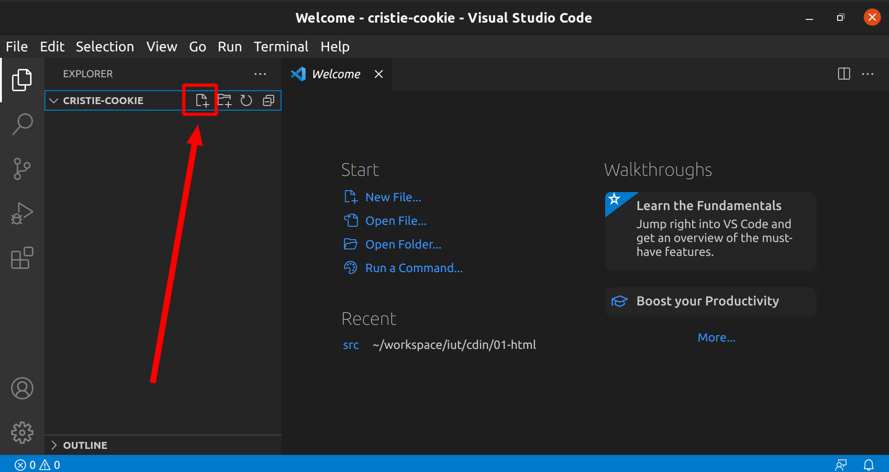
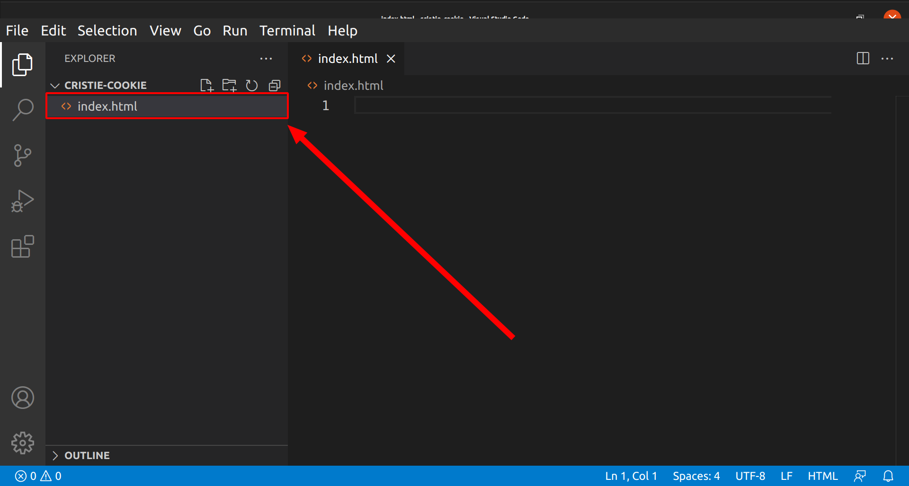

# TD 1

Dans ce TD, nous allons mettre en place votre environnement de développement,
puis écrire quelques pages simples afin de nous familiariser avec la syntaxe de
HTML.

## Prérequis

### Navigateur web

Il faut que vous ayez au moins un navigateur récent installé sur votre machine.
Vérifiez que vous avez l'un des navigateurs suivants, ou téléchargez en un le
cas échéant : 

* Firefox
* Chrome
* Safari
* Edge (version 79 au minimum)

### Editeur de code

Si vous avez déjà un éditeur de code favoris, utilisez-le. Si ce n'est pas le
cas, je vous conseille d'utiliser [Visual Studio
Code](https://code.visualstudio.com/), qui est l'un des éditeurs les plus
utilisés. Il contient par défaut tout ce qu'il faut pour écrire du code pour le
web, et il peut être étendu grâce à un très grand nombre d'extensions. Vérifiez
s'il n'est pas déjà installé sur votre machine, et téléchargez-le si ce n'est
pas le cas.

### NodeJS

NodeJS est une plateforme JavaScript. Nous ne l'utiliserons pour le moment que
pour faire tourner un serveur de développement local via le module `serve`.

Vérifiez d'abord si NodeJS est installé sur votre machine. Pour ça, ouvrez
d'abord un terminal. Sur Windows, ouvrez le menu démarrer puis tapez
"powershell". Sur macOS ouvrez l'application Terminal. Une fois le terminal
ouvert, tapez dedans les commandes `node -v` puis `npm -v` et enfin `npx -v`.
Chacune de ces commandes doit vous afficher un numéro de version de la forme
`x.y.z`.

Si les commandes vous renvoient un message du type "Commande inconnue", alors
téléchargez NodeJS sur https://nodejs.org/en/ et installez-le, puis réessayez
de lancer les commandes (après avoir fermé ou ouvert à nouveau le terminal,
pour mettre à jour les commandes disponibles).

## Notre premier site web

Pour ce TD, nous allons faire le site d'une marque de cookies : Cristie Cookie.
Sur ce site, la marque souhaite qu'il y ait 3 pages : 

* Une page d'accueil présentant brièvement la marque ainsi que les gammes de cookies qu'elle propose
* Une page présentant plus en détails les gammes de cookies
* Une page présentant plus en détails la marque

La marque nous a donné le contenu qu'elle souhaite voir apparaître sur chacune
des pages au format texte, ainsi que des images pour illustrer les gammes de
cookies. Notre rôle est d'utiliser du HTML pour rendre ce contenu accessible
sur le web.

### Création des fichiers

Notre site web est composé de 3 pages. Nous avons donc besoin de 3 fichiers
HTML.

En premier lieu, nous avons besoin de créer un dossier qui contiendra tous les
fichiers du projet. Vous pouvez le placer où vous voulez et le nommer comme
vous voulez. Par exemple, vous pouvez le nommer `cristie-cookie` et le placer
dans `C:\Users\<votre nom d'utilisateur>\Documents`.

Une fois le dossier créé, vous pouvez l'ouvrir dans Visual Studio Code. Pour
cela, ouvrez Visual Studio Code à partir du menu Démarrer, puis cliquez sur
"Fichier" > "Ouvrir un dossier" et sélectionnez le dossier que vous avez créé.

Pour le moment, ce dossier est vide. Nous allons donc créer les 3 fichiers HTML
correspondant aux 3 pages de notre site :

* Page d'accueil : `index.html`
* Page de présentant les cookies : `cookies.html`
* Page présentant la marque : `a-propos.html`

Cliquez sur le bouton "Nouveau fichier" à côté du nom du dossier ouvert dans
l'encart de gauche (Cf screenshot ci-dessous) : 

Entrez le nom du fichier : `index.html`, puis appuyez sur "Entrée". Votre
fichier est créé, il apparaît maintenant sous le nom du dossier ouvert : 

Répétez cette opération pour créer les fichiers `cookies.html` et `a-propos.html`.

### Structure générique des pages

Toutes les pages vont utiliser la même structure : 

* Une entête composée du logo de la marque (fichier `images/logo.svg` dans l'archive de contenu) et d'un menu de navigation composé d'une liste de liens :
  * Accueil : pointe sur le fichier `index.html`
  * Nos cookies : pointe sur le fichier `cookies.html`
  * A propos de nous : pointe sur le fichier `a-propos.html`
* Une zone de contenu principal dont le contenu sera différent pour chaque page
* Un pied de page contenant le texte `Christie Cookie - 143 avenue de Versailles 75016 Paris`

Notre première tâche est donc d'écrire cette structure, que nous pourrons
ensuite dupliquer sur chacune des pages afin de remplir le contenu spécifique à
chacune.

Nous avons d'abord besoin de mettre en place la structure d'un document HTML.
Pour rappel, nous avons vu ensemble cette structure dans les slides du cours.
Vous pouvez donc vous y reporter et copier/coller cette structure dans le
fichier `index.html`.

Une fois que vous avez cette structure, vous pouvez implémenter le contenu
générique décrit ci-dessus dans la partie `<body></body>` du fichier
`index.html`. Reportez-vous aux exemples du cours pour voir quelles sont les
balises adaptées à chaque besoin.

Afin de voir le résultat de votre travail dans votre navigateur, il faudra
lancer un serveur de développement local. Ouvrez un terminal dans le dossier du
projet, puis lancez la commande `npx serve`. Une fois le serveur lancé, ouvrez
un onglet de votre navigateur sur l'URL `http://localhost:5000`. Vous devriez
voir le contenu de la page `index.html` s'afficher.

### Contenu des pages

Le contenu des pages est décrit dans les fichiers texte de l'archive de
contenu. Chaque fichier texte décrit le contenu que le client souhaite voir
apparaître sur chaque page. Notre rôle est d'utiliser les balises les plus
adaptées pour chaque élément du contenu.

Suivez les indications de ces fichiers afin d'incorporer le contenu de chacune
des pages dans les 3 fichiers HTML.
