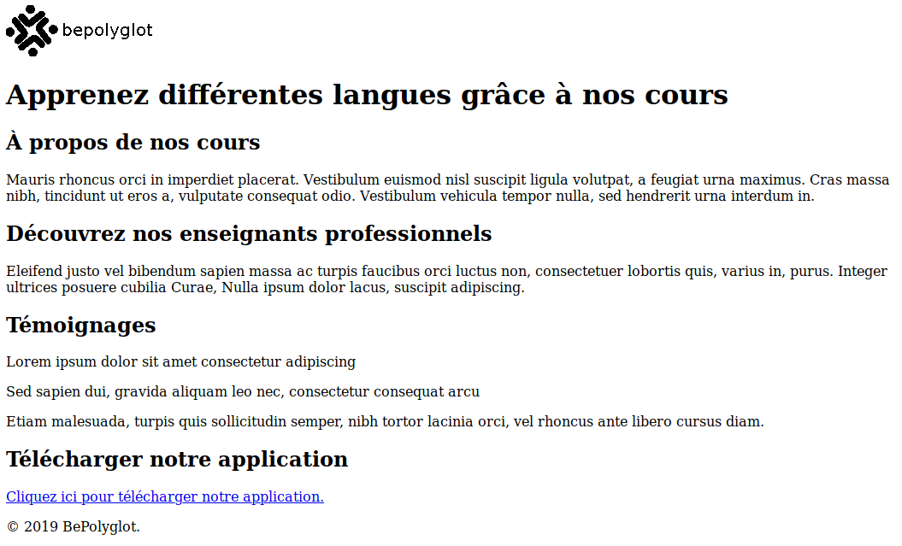

# TD introduction

Le but de ce TD est double :

* Installer un environnement de développement complet
* Développer une première page web utilisant HTML

## Installation de l'environnement

### Le navigateur web

Nous allons utiliser des navigateurs récents pour tester nos pages web.
Vérifiez que vous avez les navigateurs suivants, ou installez-les si besoin :

* Firefox https://www.mozilla.org/fr/firefox/new/
* Chrome https://www.google.com/intl/fr_fr/chrome/
* (pour Windows) Edge doit déjà être installé
* (pour macOS) Safari doit déjà être installé

### L'éditeur de texte

Pour écrire du HTML, nous avons besoin d'un éditeur de texte. Théoriquement, un
bloc-note suffit. Mais nous allons utilisé un éditeur spécialisé pour le code
(pas que HTML), qui va nous fournir des fonctionnalités comme de la coloration
syntaxique, de l'indentation automatique, etc...

Je vous suggère d'utiliser [Visual Studio
Code](https://code.visualstudio.com/). Toutefois, si vous avez déjà une
préférence pour un autre éditeur de code, gardez-le. N'importe quel éditeur
fera l'affaire.

## Notre première page web

### Étape 1

Créez un dossier sur votre machine dans lequel vous mettrez les fichier de
votre site web. Par exemple, un dossier `site-web`. Dans ce dossier, créez un
fichier `index.html`.

### Étape 2

Ouvrez le fichier `index.html` dans votre éditeur de code. Copiez-collez la
structure de base d'une page web que nous avons vu pendant le cours.

Ouvrez la page dans votre navigateur (vous pouvez double-cliquer sur le fichier
dans votre explorateur de fichier, il devrait s'ouvrir dans votre navigateur
par défaut).

### Étape 3

Modifiez le corps de la page HTML afin d'obtenir la page suivante :

* L'image du logo vous est fournie dans [`logo.png`](https://raw.githubusercontent.com/drazik/cdin/master/01-introduction/logo.png).
* Pensez à délimiter chaque section de la page
* Utilisez les bons niveaux de titre
* Pour les témoignages, considérez que chaque témoignage est autonome
* Le lien de téléchargement de l'app mène vers la page de votre choix
