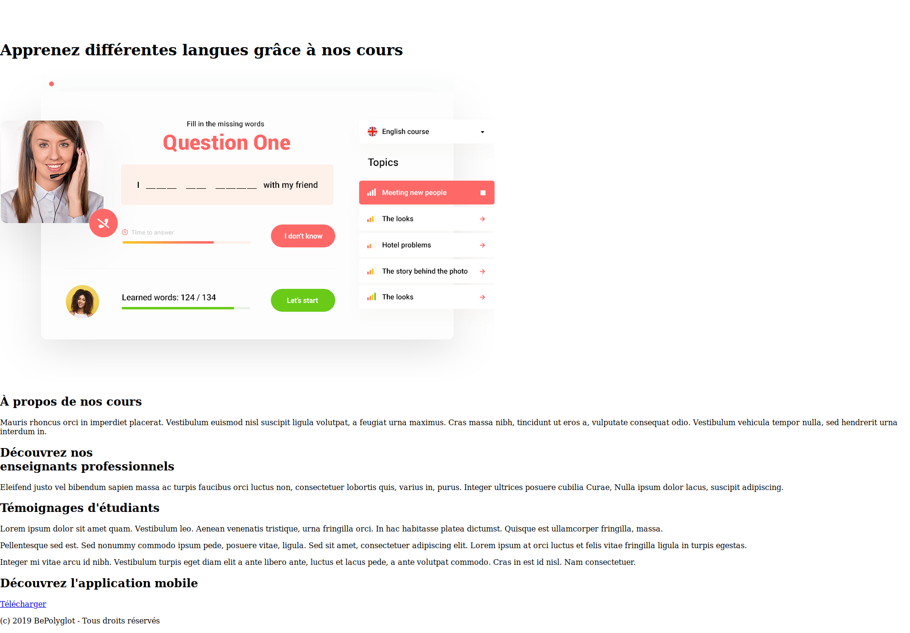
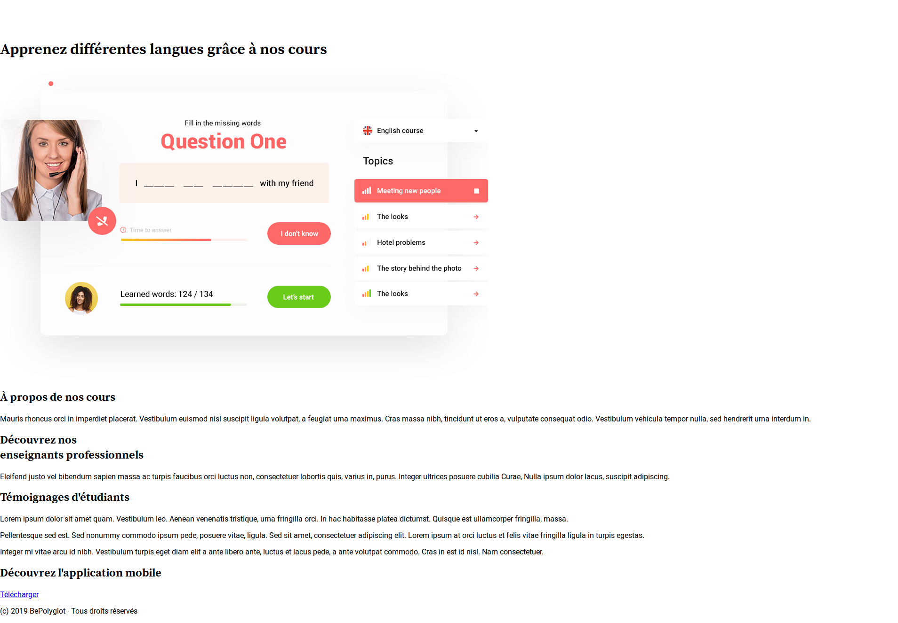
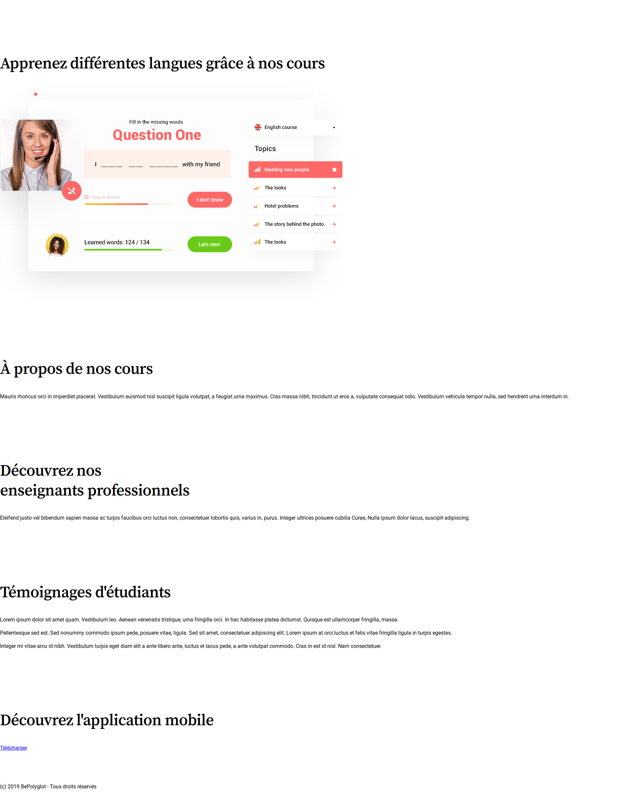
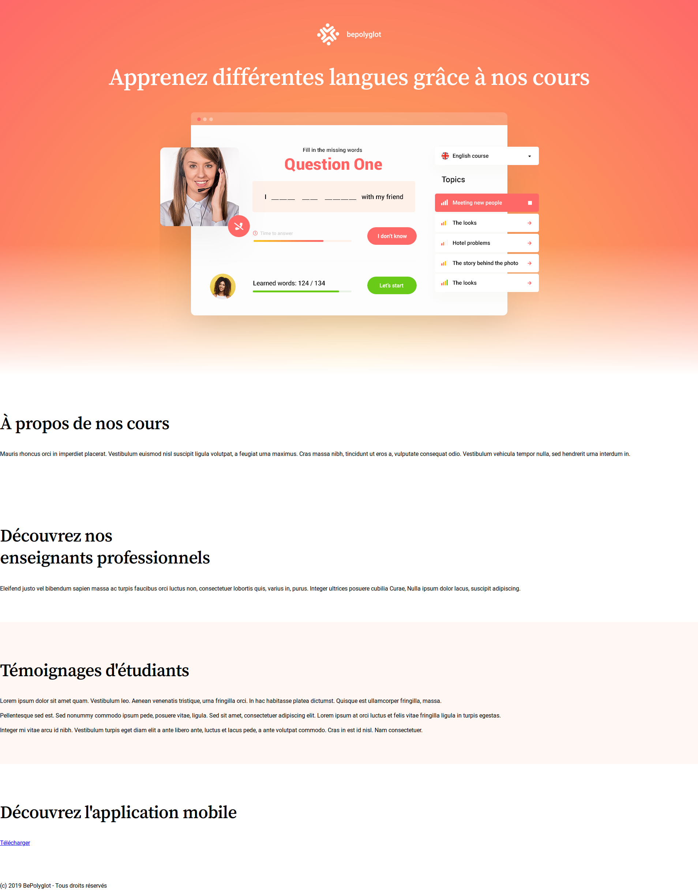
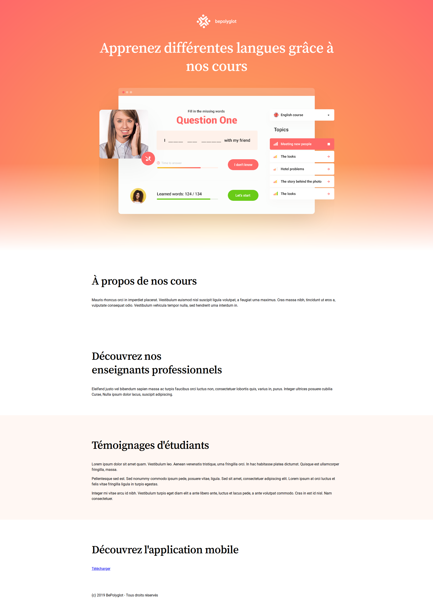
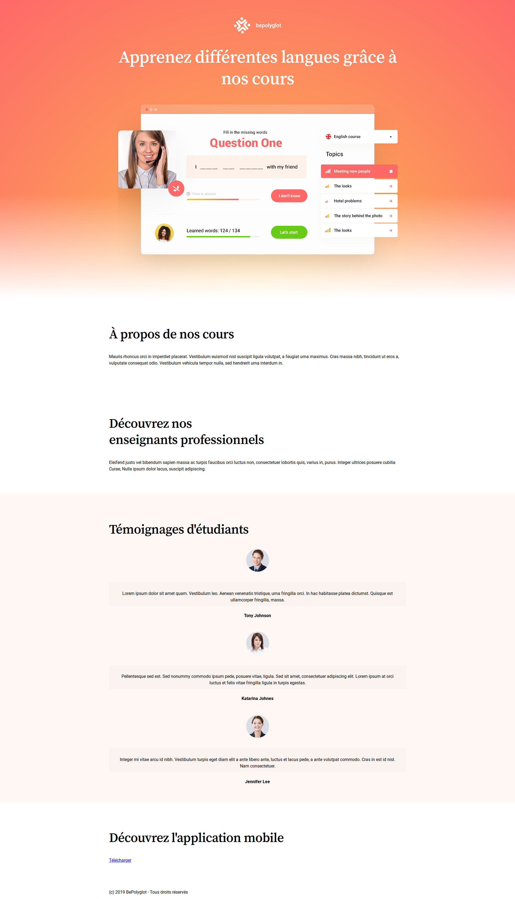
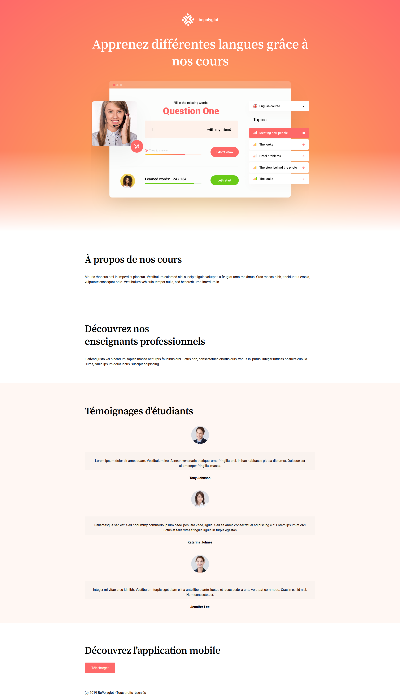

# TD Bases de CSS

Le but de ce TD est d'itérer sur notre travail de la semaine précédente afin
d'y ajouter un peu de style. À la fin du TD, nous aurons le résultat suivant :


Parce que chacun peut être arrivé à un résultat différent lors du TD précédent,
je vous suggère de télécharger l'archive
[resources.zip](https://github.com/drazik/cdin/blob/master/02-css-bases/ressources.zip),
qui contient tout ce qu'il faut pour démarrer ce TD sur une base commune.

Pour styliser notre page web, nous allons adopter une approche « composants ».
C'est à dire que nous allons mettre en place des blocs génériques de manière à
ce qu'ils soient reutilisables (au sein de la page que nous sommes en train de
développer, mais aussi sur une autre page).

## Étape 1 : lier un fichier CSS à la page web

Premièrement, créez un fichier `style.css`, puis liez-le au fichier HTML en ajoutant une balise `<link />` dans le `<head>` :

```html
<link rel="stylesheet" href="style.css" />
```

Afin de vérifier que le fichier CSS est bien lié à la page, vous pouvez y ajouter le code suivant :

```css
body {
  background-color: red;
}
```

Si la page a un fond rouge, ça fonctionne.

Vous pouvez maintenant copier-coller le style de base que nous avons vu
ensemble dans les slides du cours afin d'obtenir le style suivant :



## Étape 2 : importer les polices d'écritures

Notre page web va utiliser des polices d'écritures externes :

* Roboto pour le contenu en général
* Source Serif Pro pour les titres

Nous allons utiliser Google Fonts pour récupérer ces polices. Ce service
fournit un bout de code permettant d'inclure les polices dans notre fichier CSS
:

```css
@import url('https://fonts.googleapis.com/css?family=Roboto:400,700|Source+Serif+Pro:400,600,700&display=swap');
```

Placez cette ligne tout en haut de votre fichier CSS. Puis appliquez
`font-family: 'Roboto', Arial, sans-serif;` au `body` et `font-family: 'Source
Serif Pro', serif;` à tous les niveaux de titres (de `h1` à `h6`). Vous
obtiendrez alors le résultat suivant :



## Étape 3 : le style générique des sections

Notre page est découpée en plusieurs sections :

* Le header
* La section « À propos de nos cours »
* La section « Découvrez nos enseignants professionnels »
* La section « Témoignages d'étudiants »
* La section « Découvrez l'appliation mobile »
* Le footer

Hormis le footer, toutes les sections ont un style global similaire :

* Un padding vertical de `64px`

La première chose à faire est donc d'écrire le CSS correspondant à ce style
générique, sous une classe `.section` que l'on pourra appliquer à toutes les
sections afin qu'elles se voient appliquer ce style :

```html
<header class="section">
  <!-- ... -->
</header>
<section class="section">
  <!-- ... -->
</section>
<section class="section">
  <!-- ... -->
</section>
```

Ensuite, on peut voir que le contenu de ces sections a aussi un style générique :

* Un titre avec un `font-size` de `48px` (sauf le header, pour lequel celui-ci est de `4rem`, mais ce cas spécifique sera géré à l'étape suivante) avec un `letter-spacing` de `-1px`, un `line-height` de `1.25`, un `font-weight` de `600` et la police « Source Serif Pro »
* Un `line-height` de `1.5` pour le contenu textuel (autre que les titres)

On peut donc écrire une classe `.section__title` regroupant les styles des
titres, et ajouter les autres styles de contenu à la classe `.section`.
Enfin, n'oubliez pas d'ajouter la classe `section__title` aux titres des
sections :

```html
<section class="section">
  <h2 class="section__title">
    Titre de la section
  </h2>
</section>
```

Une fois ceci fait, vous devriez obtenir le style suivant :



## Étape 4 : les différents types de sections

On distingue 4 types de sections :

* Celles sur fond blanc
* Celles sur fond gris clair
* Le header qui a un fond en dégradé et du texte blanc
* Celles dont le contenu est centré (cette variante peut être combinée avec l'une des 3 autres)

Il convient donc d'écrire une classe pour chaque type de section :

* `.section--normal` : fond blanc, texte noir
* `.section--alternate` : fond gris (`#fff7f3`), texte noir
* `.section--header` : fond dégradé, texte blanc
* `.section--centered` : contenu centré (`text-align: center`)

Obtenir le bon dégradé pour la variante `.section--header` n'est pas
trival. Il faut combiner 2 dégradés : un `radial-gradient` et un
`linear-gradient`. Ce dégradé n'étant pas le coeur même du TD, il n'est pas
question de passer du temps à chercher comment l'obtenir. Voici donc le CSS
permettant de faire ce double dégradé :

```css
.section--header {
  background-image: linear-gradient(to bottom, transparent 0%, transparent 65%, white 100%), radial-gradient(circle at bottom, #fbbe4f 0, #fe6969 100%);
}
```

Une autre subtilité de la classe `.section--header` est que les `.section__title` qui se trouvent contenus dans un élément qui possède cette classe doivent avoir un `font-size` de `64px`.

Une fois chaque classe de variante terminée, appliquez appliquez-les aux sections qui leur correspondent, et vous obtiendrez le style suivant :



## Étape 5 : la « zone utile » (ou « wrapper »)

Sur la maquette, on voit que le contenu des sections n'utilise pas toute la
largeur de la page, mais est contraint à une largeur maximale. Cette zone est
appelée « zone utile » ou « wrapper ». Elle permet d'éviter d'avoir un contenu
trop large et difficile à lire sur des grands écrans.

Ici, la zone utile s'étend sur un maximum de `1100px`. C'est à dire qu'elle
doit faire 100% de l'écran, mais lorsqu'elle atteint `1100px`, elle ne doit
plus grandir. De plus, cette zone utile est centrée. Pour centrer un élément
block, `text-align` ne fonctionne pas. Essayez plutôt la valeur `auto` pour les
`margin` horizontales.

Écrivez la classe `.wrapper` permettant d'obtenir ce style. Puis utilisez-la
dans votre code HTML afin que le contenu de vos sections soient contraints dans
ce wrapper.

Une fois ceci fait, vous aurez le style suivant :



## Étape 6 : les témoignages

Pour le moment, chaque témoignage est un `<article>` dans lequel est placé
`<p>` qui contient le témoignage en question. Toutefois, la maquette nous
indique que chaque témoignage est aussi accompagné de la photo et du nom de son
auteur. Nous allons donc avoir besoin de mettre à jour notre code HTML pour y
ajouter une image et le nom de l'auteur.

Pour l'image, utilisez tout simplement un ``. Chaque image vous est
fournie et à pour nom `testimonyNN.jpg` où `NN` va de 01 à 03.

Pour le nom de l'auteur, utilisez un élément HTML qui vous semble être le plus
adapté pour ce contenu.

Examinons maintenant le style de ce composant « temoignage » :

* Son contenu est centré (nous voulons qu'il soit centré même si il est dans une section dont le contenu n'est pas lui-même centré)
* L'image est séparée du texte du témoignage par une marge de `16px` et est arrondie (utilisez `border-radius` pour obtenir cet arrondi)
* Le texte du témoignage a une couleur de fond (`#faf3ef`), ainsi que du `padding` (`30px` en haut, `40px` sur les côtés et `10px`, en bas)
* Le nom de l'auteur est séparé du contenu par une marge de `24px` et est en gras
* Chaque témoignage est séparé du témoignage précédent par une marge de `48px`

En ayant ceci en tête, vous pouvez maintenant écrire les classes suivantes :

* `.testimony` : l'élément racine du composant
* `.testimony__image` : l'image de l'auteur
* `.testimony__content` : le texte du témoignage
* `.testimony__author` : le nom de l'auteur

Puis appliquez-les aux bons éléments pour obtenir l'affichage suivant :



## Étape 7 : le lien « Télécharger »

La dernière section de la page (« Découvrez l'application mobile ») contient un
lien. Celui-ci est stylisé pour le faire ressembler à un bouton. Nous
considérerons que nous avons devant nous un composant de bouton, et allons donc
écrire une classe `.button` que nous pourrons appliquer aux liens qui doivent
ressembler à des boutons, mais aussi éventuellement aux vrais boutons (éléments
`<button>`).

Ce composant a les styles suivants :

* Un fond rose (`#fe6969`)
* Une couleur de texte blanche
* Pas de soulignement (`text-decoration: none`)
* Un padding vertical de `16px` et horizontal de `32px`
* Un `border-radius` de `5px`
* Lorsqu'on passe la souris dessus ou lorsqu'il est en état de focus, la couleur de fond devient `#f16464`

Écrivez le style de ce composant et appliquez la classe `.button` au bon élément.



## Étape 8 : le footer

Le footer est lui aussi un composant. Il reçoit les styles suivants :

* Une couleur de fond `#2b2b2b`
* Un padding vertical de `16px`
* Une couleur de texte blanche

Écrivez la classe `.footer` correspondant et appliquez-la au bon élément
pour obtenir le style suivant :


## Conclusion

Nous avons découpé notre maquette de manière logique et avons développé des
composants réutilisables et composables. Ce découpage nous permet d'avoir une
plus grande flexibilité et maintenabilité. Si nous voulons ajouter une nouvelle
section, nous pouvons ajouter un élément HTML et lui donner les bonnes classes
afin d'obtenir le bon style.

Évidemment, si la nouvelle section est une nouvelle variante, il faudra écrire
le CSS correspondant à cette nouvelle variante. Mais le fait d'avoir extrait
une partie générique dans la classe `.section` nous permettra de ne pas avoir à
réécrire cette partie générique. Seul le code correspondant à la nouvelle
variante devra être écrit en plus.

Nous avons aussi utilisé la méthodologie BEM (Block Element Modifier) pour
nommer nos classes. Pour rappel, cette méthodologie nous impose un cadre
relativement strict pour nommer nos classes. Elle part du principe qu'un
élément est soit :

* Un « block », c'est à dire la racine d'un composant
* Un « element », c'est à dire un élément qui n'a de sens que si il est placé à l'intérieur du « block » lui correspondant
* Un « modifier », c'est à dire une variante d'un block ou d'un element
