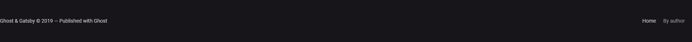

# Bases de CSS

Dans ce TD, nous allons ajouter une première couche de CSS sur les pages créées
lors de la séance précédente.

Le but est d'écrire vos premières règles CSS afin de décrire le style des
différents blocs qui composent la maquette de blog dont nous avons écrit la
structure HTML lors du [TD précédent](../../01-introduction/TD).

Pour rappel, la maquette est visible sur Figma (il faut créer un compte) :
https://www.figma.com/file/cEgyaw22dkpsr7RbDttNgA/Blog?node-id=0%3A1

## Mise en place de l'environnement

Ce TD se base sur la correction du TD précédent. [Téléchargez la correction de
ce TD (au format ZIP)](../../01-introduction/correction.zip), puis dézippez
l'archive dans le dossier de votre choix.

Vous devriez avoir la structure de fichier suivante dans ce dossier :

```console
.
├── img
│   ├── author-avatar.png
│   └── post-illustration.png
├── article.html
├── by-author.html
└── index.html

1 directory, 5 files
```

Une fois que vous avez ce dossier en place, vous pouvez l'ouvrir dans Visual
Studio Code (Fichier > Ouvrir un dossier).

## Etape 1 : création d'un fichier CSS

En premier lieu, nous allons créer le fichier CSS dans lequel nous allons
écrire notre code. Créez un fichier `style.css` et écrivez dedans la règle suivante :

```css
body {
  background-color: red;
}
```

Puis ouvrez le fichier `index.html`, et ajoutez dedans une balise `link` afin
de lier le fichier HTML au fichier CSS :

```diff
<head>
  <meta charset="utf-8" />
  <title>Ghost + Gatsby</title>
+  <link rel="stylesheet" href="style.css" />
</head>
```

Ouvrez maintenant le fichier `index.html` dans un navigateur (click droit sur
le fichier, puis "Ouvrir avec", et sélectionnez Firefox ou Chrome). Vou devriez
voir que la couleur de fond de la page est maintenant rouge, comme sur la
capture ci-dessous :


Une fois que vous avez obtenu cet affichage, cela signifie que votre fichier
HTML importe bien votre fichier CSS. Vous pouvez supprimer la règle de test
dans le fichier `style.css` et passer à la suite.

## Etape 2 : styles globaux

Avant de commencer à écrire les styles de chacun des blocs qui composent la
page, nous allons définir quelques styles qui s'appliquent à l'ensemble de la page :

* Réinitialisation des marges du `body`
* polices d'écritures (fonts)

### Réinitialisation des marges du `body`

Par défaut, la balise `body` se voit appliquer par le navigateur une marge
externe `margin` de `8px`. Pour le constater, vous pouvez ouvrir les outils de
développeur dans votre navigateur en appuyant sur la touche <kbd>F12</kbd>.

Les outils de développeur (abrégés "devtools") permettent d'inspecter divers
aspects des pages web. Pour le moment, le seul onglet qui va nous intéresser
sera l'onglet qui affiche la structure HTML de notre page ainsi que le CSS
appliqué à chaque élément. Cet onglet est nommé "Inspecteur" dans Firefox, et
"Elements" dans Chrome. Dans les deux cas, il présente d'une part la structure
HTML composant la page, et d'autre part les styles appliqués à l'élément en
court d'inspection. Pour inspecter un élément, il suffit de cliquer dessus dans
la structure HTML. Par exemple, dans Firefox :


Dans les devtools, vous pouvez constater en cliquant sur l'élément `body` que celui-ci possède une `margin` de `8px` :


Sur la maquette, nous constatons que nous ne voulons que les différents
éléments soit "bord à bord". Cette marge sur le body nous en empêchera. Il
convient donc de réinitialiser cette marge pour y affecter une valeur de `0px`.

Ecrivez donc une règle qui cible l'élément `body`, et qui affecte la valeur
`0px` à la propriété `margin`.

Une fois ceci fait, vous devriez constater que les éléments qui composent la
page sont maintenant collés aux bords de la fenêtre du navigateur :


### Polices d'écritures (fonts)

Actuellement, notre page utilise la police d'écriture (aussi appelé "font") par
défaut du navigateur. Un coup d'oeil dans l'onglet "Fonts" (dans Firefox) ou
"Computed" (dans Chrome) après avoir sélectionné un élément qui contient du
texte nous montre que la police utilisée est Times New Roman :


En comparant le texte affiché dans le navigateur avec celui affiché sur les
maquettes, on voit tout de suite que la police ne correspond pas. En cliquant
sur un élément contenant du texte dans Figma, on voit que la police utilisée
est "Roboto". En regardant la page de contenu d'un article, on voit qu'une
autre police est utilisée : "Lora".


Nous voulons donc "installer" ces deux polices afin qu'elles soient utilisables
sur nos pages web. Pour cela, nous allons utiliser [Google
Fonts](https://fonts.google.com). Sur ce service, vous pouvez commencer par
rechercher la police "Roboto". Elle devrait s'afficher dans la liste. Vous
pouvez cliquer dessus afin de voir la page de détails de cette police. Nous
avons besoin des styles "Regular 400" et "Bold 700". Cliquez donc sur "Select
this style" à côté de ces deux styles. Dans l'encart de droite, vous devez
avoir les deux styles sélectionnés. Revenez sur la page d'accueil (en cliquant
sur le logo "Google Fonts" en haut), puis recherchez la police "Lora". Cliquez
sur la police pour en afficher le détail, puis sélectionnez le style "Regular
400". Vous devriez maintenant avoir dans l'encart de droite ceci :


Vous pouvez maintenant cliquer sur l'onglet "Embed" dans cet encart. Il vous
est alors donné un bout de code HTML (balise `link`) à copier/coller dans votre
fichier `index.html`, à l'intérieur de la balise `head`. Faites-le :

```diff
<head>
  <meta charset="utf-8" />
  <title>Ghost + Gatsby</title>
  <link rel="stylesheet" href="style.css" />
+ <link href="https://fonts.googleapis.com/css2?family=Lora&family=Roboto:wght@400;700&display=swap" rel="stylesheet" />
</head>
```

Une fois ceci fait, vous pouvez définir que la police à utiliser par tous les
éléments de votre page est "Roboto". Pour cela, vous pouvez définir la
propriété `font-family` sur la balise `body`. `body` étant un élément parent
commun à tous les éléments qui s'affichent sur la page, le système de cascade
de CSS s'occupera de faire en sorte que tous les éléments héritent de cette
police.

```css
body {
  /* ... */
  font-family: "Roboto", sans-serif; /* sans-serif est une valeur de secours (fallback) dans le cas où la police Roboto n'a pas pu être chargée. Elle correspond à la police "sans serif" par défaut du système d'exploitation */
}
```

Une fois ceci fait, vous devriez constater que la police d'écriture a changé
sur votre page :


## Etape 3 : styles du header

Maintenant que nous avons les styles globaux en place, nous allons pouvoir
commencer à écrire les styles de chaque partie du site. Commençons par le header :


Commencez par ajouter la classe `header` sur l'élément du header dans le
fichier `index.html`. Une fois ceci fait, écrivez une nouvelle règle qui cible
les éléments portant la classe `header` dans le fichier `style.css`.

Dans cette règle CSS, nous allons définir tous les styles propres au header :

* sa hauteur
* son image de fond (et son positionnement)
* la couleur et le positionnement du texte qui se trouve dans l'élément

### Hauteur du header

La hauteur est définie grâce à la propriété `height`. La valeur à donner à
cette propriété dans notre cas dépend de ce que nous indique la maquette. En
cliquant sur le header dans Figma, on a accès aux propriétés de l'élément :


Ici, on voit que la hauteur de l'élément est de `480px`. Ajoutez la propriété
`height` avec la valeur `480px` à la règle CSS du header. Une fois fait, vous
obtenez l'affichage suivant :


### Image de fond du header

Afin d'appliquer l'image de fond sur le header, nous avons d'abord besoin de
récupérer le fichier de l'image. Pour cela, cliquez sur l'élément du header
dans Figma, puis dans l'encart de droite, sélectionnez l'affichage "Table" pour
les styles :


Dans ce mode d'affichage, vous pouvez cliquer sur le nom de l'image afin de
l'ouvrir dans un nouvel onglet et l'enregistrer sur votre machine (click droit
sur l'image puis "Enregistrer l'image").


Enregistrez l'image sous le nom `header.jpg` dans le dossier `img` de votre
projet.

Maintenant que nous avons le fichier de l'image, nous pouvons aller dans notre fichier `style.css`, dans la règle concernant le header, et ajouter 3 propriétés :

* [`background-image`](https://developer.mozilla.org/fr/docs/Web/CSS/background-image) : pour spécifier l'image à utiliser en tant qu'image de fond sur cet élément
* [`background-size`](https://developer.mozilla.org/fr/docs/Web/CSS/background-size) : pour spécifier la taille que doit prendre l'image de fond. Ici, nous souhaitons qu'elle s'étire sur l'ensemble de l'élément, sans se déformer
* [`background-position`](https://developer.mozilla.org/fr/docs/Web/CSS/background-position) : pour spécifier la position de l'image de fond dans l'élément. Ici, nous souhaitons qu'elle soit centrée en hauteur et en largeur

Une fois ces propriétés attribuées avec les bonnes valeurs, vous obtiendrez :


### Couleur et tailles du texte

La couleur de texte par défaut est le noir. Maintenant que le header a une
image de fond dont la teinte dominante est le gris foncé, le texte est
illisible. Sur la maquette, le texte est en blanc. Commencez par utiliser la
propriété CSS [`color`](https://developer.mozilla.org/fr/docs/Web/CSS/color)
pour que le texte s'affiche en blanc :


On constate que la couleur des liens de navigation n'a pas été affectée. C'est
normal, les liens possèdent leur propre couleur, qui est définit de manière
plus spécifique que notre sélecteur actuel.

Pour modifier la couleur des liens à l'intérieur du header, nous pourrions
écrire une nouvelle règle CSS ayant pour sélecteur `.header a`. Cette règle
ciblerait les éléments de type `a` contenus à l'intérieur d'un élément
possédant la classe `header`. Mais si on observe bien la maquette, on
s'aperçoit que la navigation du header et celle du footer sont identiques. Nous
allons donc traiter ce menu de navigation comme un bloc à part du header, même
si il est contenu dedans.

Commencez par attribuer la classe `nav` à l'élément `<nav>` contenu dans le
header. Puis attribuez la classe `nav-list` à l'élément `<ul>` contenu dans
l'élément `<nav>`.

Dans le fichier `style.css`, créez une nouvelle règle CSS ciblant les éléments
de type `a` contenus dans les éléments possédant la classe `nav`. Et faites en
sorte que ces éléments s'affichent en blanc (propriété `color`) et ne soient
pas soulignés (propriété
[`text-decoration`](https://developer.mozilla.org/fr/docs/Web/CSS/text-decoration)). Vous obtiendrez l'affichage suivant :


Ajoutez maintenant une nouvelle règle CSS ciblant les éléments possédant la
classe `nav-list`. Dans cette règle, utilisez la propriété
[`list-style-type`](https://developer.mozilla.org/fr/docs/Web/CSS/list-style-type)
pour supprimer les puces de la liste, ainsi que la propriété `padding-left`
afin de supprimer la marge à gauche par défaut des listes. Puis ajoutez la
déclaration `display: flex;` afin de faire en sorte que les items de la liste
s'affichent côte à côte (nous verrons plus en détails le module Flexbox dans un
prochain cours).

Enfin, créez une nouvelle règle ciblant tous les éléments (sélecteur universel
`*`) étant des décendants directs (combinateur `>`) des éléments possédant la
classe `nav-list`. Dans cette règle, utilisez la propriété `margin-right` avec
la valeur `20px`. Cela aura pour effet d'espacer les liens entre eux.


On voit sur la maquette que les deux liens n'ont pas exactement la même
couleur. En fait, le lien actif est blanc, tandis que l'autre lien est un peu
grisé.  Commencez par utiliser la propriété
[`opacity`](https://developer.mozilla.org/fr/docs/Web/CSS/opacity) pour griser
tous les liens contenus dans la navigation. Puis ajoutez une classe `active`
sur le lien `home`, et créez une nouvelle règle ciblant les éléments possédant
la classe `active` et se trouvant à l'intérieur des éléments possédant la
classe `nav`. Dans cette règle, réinitialisez la propriété `opacity` à la
valeur `1`.


Enfin, nous voulons que les liens deviennent blancs lorsqu'on passe notre
souris dessus. Pour cela, ajoutez un sélecteur utilisant la pseudo-classe
`:hover` au sélecteur précédent. Puis tentez de passer votre souris sur un lien
qui n'est pas actif.

Le header est globalement terminé. Vous pouvez apporter les dernières finitions
en regardant sur la maquette les différentes tailles de texte (`font-size`). Nous ne connaissons pas encore assez bien le module Flexbox pour bien gérer le positionnement des différents éléments. Nous nous contenterons pour le moment d'appliquer sur le header les déclarations suivantes :

```css
.header {
  display: flex;
  flex-direction: column;
  align-items: center;
  justify-content: center;
}
```

Cela aura pour effet de centrer horizontalement et verticalement les éléments
du header.


## Etape 4 : styles du footer

Le bloc suivant qui est commun à toutes les pages est le footer.


Attribuez la classe `footer` à l'élément `<footer>`, puis créez une règle CSS
ciblant cette classe. Dans cette règle CSS, utilisez les propriétés suivantes :

* `background-color` pour définir la couleur de fond
* `font-size` pour définir la taille du texte
* `color` pour définir la couleur du texte
* `padding-left/right/top/bottom` pour définir les marges internes de l'élément

Les valeurs de ces trois propriétés vous sont données dans Figma. Cliquez sur
les différents éléments et observez l'encart de droite, vous y trouverez les
valeurs.

Ajoutez sur l'élément `<nav>` et ses enfants les mêmes classes que sur celui du
header, afin d'obtenir le même résultat.

Enfin, ajoutez les déclarations suivantes au footer :

```css
.footer {
  display: flex;
  justify-content: space-between;
}
```

Vous obtiendrez l'affichage suivant :



Sur la maquette, on constate que le contenu du footer n'est pas collé aux bords
gauche et droits. On a donc besoin d'un élément supplémentaire afin de
contraindre le contenu à ne pas s'étendre au-delà d'une largeur donnée. Un tel
élément porte souvent le nom de "wrapper".

Ajoutez un élément `<div>` autour du contenu du footer, et attribuez-lui la
classe `wrapper`. Dans le CSS, créez maintenant une règle ciblant la classe `wrapper`, et y attribuant les styles suivants :

* Une largeur de `100%`
* Une largeur maximale de `1120px`
* Des marges horizontal (gauche et droite) automatiques

Puis créez une nouvelle règle ciblant les éléments possédant la classe `wrapper` étant des descendants d'éléments possédant la classe `footer` et déplacez-y les déclarations

```css
display: flex;
justify-content: space-between;
```

dans cette nouvelle règle.

Vous obtiendrez le résultat suivant :


## Etape 5 : styles du contenu principal

TODO
