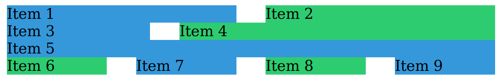
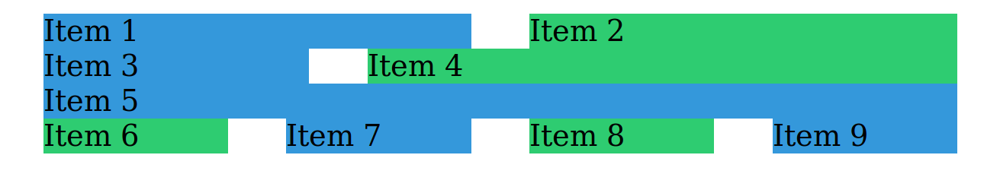
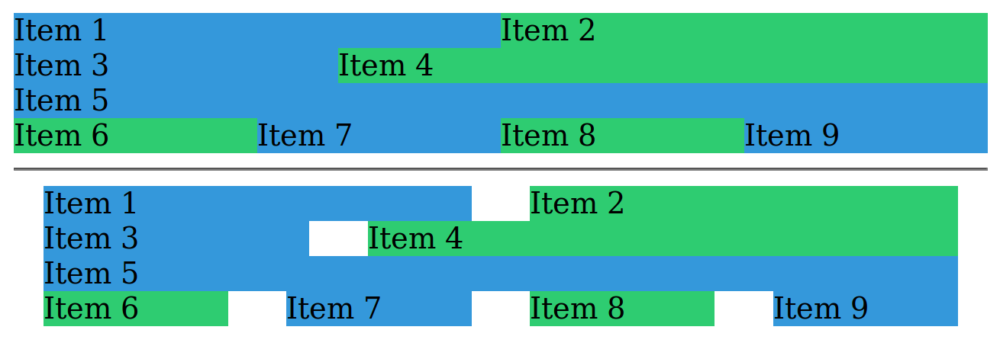
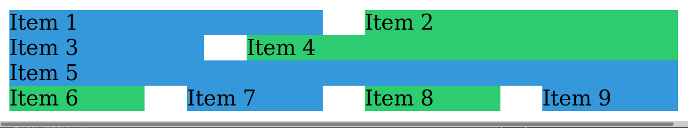
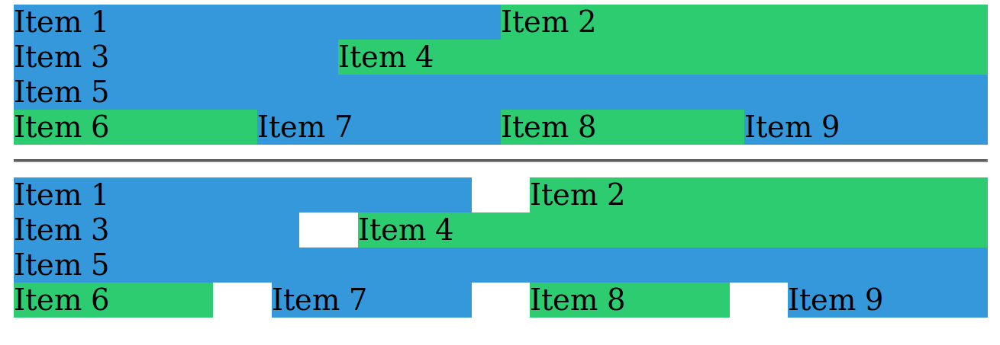

# TD mise en page

Dans ce TD, nous allons développer un composant de grille, et nous
l'utiliserons sur BePolyglot, que nous avons développé dans les TD précédents.

Une grille permet de diviser une page web en zones (cellules), tout en ayant
une cohérence visuelle sur l'ensemble de la page. Les grilles sont
omniprésentes dans le web. Tous les frameworks d'interface utilisateur majeurs
proposent une implémentation de grille (par exemple [Bootstrap Grid
system](https://getbootstrap.com/docs/4.3/layout/grid/), [Foundation XY
Grid](https://foundation.zurb.com/sites/docs/xy-grid.html), [Material UI
grid](https://material-ui.com/components/grid/#grid)).

Nous allons développer notre propre implémentation basique de grille. Pour
cela, nous allons utiliser Flexbox.

## Étape 1

Pour utiliser notre grille, nous souhaitons pouvoir utiliser l'API suivante :

```html
<div class="grid">
  <div class="grid__item grid__item--1-2">Item 1</div>
  <div class="grid__item grid__item--1-2">Item 2</div>
  <!-- ... -->
</div>
```

Nous avons :

* un élément racine qui porte la classe `grid`
* n éléments à l'intérieur, chacun portant la classe `grid__item`, ainsi qu'un modifier indiquant la taille que ceux-ci doivent occuper dans la grille (nous aborderons ce sujet plus en détails après)

Initialisez le TD en créant un fichier HTML contenant la structure précédente,
ainsi qu'un fichier CSS vide, et liez les deux (avec une baslie `<link />`).

## Étape 2

Commençons par écrire le style de la classe `grid`. Nous souhaitons utiliser
Flexbox pour gérer l'affichage des items. La première chose à faire est donc de
faire en sorte que `grid` utilise le mode d'affichage flexbox.

Une fois ceci fait, les items s'affichent bien l'un à côté de l'autre, mais
leur largeur dépend de leur contenu. Nous souhaitons donner une taille précise
à chacun d'entre eux.

## Étape 3

Les items ont un modifier `grid__item--1-2`, indiquant la taille qu'ils doivent
occuper en largeur. Ici, `grid__item--1-2` signifie qu'on souhaite que ces
items occupent 1/2 de la largeur de la grille. À titre d'exemple, voici
d'autres modifiers que nous pourrons ajouter :

* `grid__item--1-1`: 100% de la largeur
* `grid__item--1-3`: 1/3 de la largeur
* `grid__item--1-4`: 25% de la largeur

La liste des modifiers possibles est virtuellement infinie. Mais nous allons
nous concentrer sur `grid__item--1-2` dans un premier temps.

Premièrement, nous souhaitons faire en sorte que les `grid__item` ne
grandissent ni ne rétrécissent automatiquement. Appliquez-leur un `flex-grow`
et un `flex-shrink` permettant d'obtenir ce comportement.

Ensuite, notre but est de faire en sorte que les éléments qui portent la classe
`grid__item-1--2` fassent 50% de la largeur de leur élément parent. Appliquez
leur donc un `flex-basis` pour qu'ils fassent la largeur voulue.

Vous devriez maintenant avoir vos deux éléments qui se trouvent l'un à côté de
l'autre et font chacun 50% de la largeur de leur élément parent.

Pour pouvoir visualiser plus facilement chaque item, vous pouvez utiliser le CSS suivant :

```css
.grid__item:nth-child(even) {
  background-color: #2ecc71;
}

.grid__item:nth-child(odd) {
  background-color: #3498db;
}
```

## Étape 4

Que se passe-t-il si on ajoute un 3ème item qui fait lui aussi 50% de la
largeur ?

```html
<div class="grid">
  <div class="grid__item grid__item--1-2">Item 1</div>
  <div class="grid__item grid__item--1-2">Item 2</div>
  <div class="grid__item grid__item--1-2">Item 3</div>
  <!-- ... -->
</div>
```

Puisqu'on a demandé aux items de ne pas rétrécir, alors on se retrouve avec une
barre de scroll horizontal. On souhaite faire en sorte que les éléments qui
dépassent aillent à la ligne, plutôt que de dépasser de la ligne. Pour cela,
utilisez la propriété `flex-wrap` sur le container, avec la valeur permettant
d'arriver au résultat souhaité.

## Étape 5

De la même manière que vous avez implémenté le modifier `grid__item--1-2`, implémentez maintenant les modifiers suivants :

* `grid__item--1-1`: 100% de la largeur
* `grid__item--1-3`: 1/3 de la largeur
* `grid__item--2-3`: 2/3 de la largeur
* `grid__item--1-4`: 25% de la largeur

## Étape 6

Nos items de grille sont pour le moment tous collés les uns aux autres. Mais
parfois on aimerait que nos items soient séparés par un petit espacé, appelé «
gouttière » (« gutter » en anglais).

Nous aimerions proposer cette possibilité sur notre grille, et avoir une
gouttière de `32px` entre nos éléments :



Premièrement, copiez-collez votre grille précédente, et ajoutez-y un modifier
`grid--gutters`.

Toutes les règles que nous allons écrire dans cette partie ne devront être
affectées qu'aux éléments qui ont le modifier `grid--gutters` et aux items qui
se trouvent dans un `grid--gutters`. Rappelez-vous que pour cibler « les
éléments B se trouvant dans un élément A », on utilise la syntaxe `A B { /* ...
*/ }`.

Pour arriver à ce résultat, nous allons commencer par affecter aux items un
`padding-left` et un `padding-right` correspondant à la moitié de la gouttière
(soit `16px`).

Malheureusement, on n'obtient par le résultat voulu...


La raison pour laquelle on obtient ce résultat est que par défaut, le modèle de
boîte (« box model ») fait en sorte que la largeur finale d'un élément est
égale à sa largeur + sa bordure + son padding. Ici, la largeur de nos éléments
n'est donc plus de `50%` par exemple, mais de `50% + 16px (padding-left) + 16px
(padding-right)`. Et donc le navigateur fait revenir à la ligne les éléments à
des endroits non voulus.

Pour régler ce problème, on peut affecter la propriété `box-sizing: border-box`
aux items. Cette propriété et cette valeur font en sorte de modifier le calcul
des dimensions des boîtes pour inclure la bordure et le padding dans la largeur
demandée. C'est à dire que lorsqu'on demande à un élément de faire une largeur
de `50%` et d'avoir `16px` de padding à gauche et à droite, alors le padding
est inclut dans les `50%` de largeur au lieu de s'y additioner. Avec ceci,
l'affichage commence à ressembler à ce qu'on souhaite avoir :



Toutefois, il reste un petit détail : puisque chaque élément a une marge à
gauche et à droite, ma grille ne semble plus prendre l'ensemble de la largeur
de son conteneur, et une grille avec gouttière semble moins large qu'une grille
sans gouttière :



Pour régler ce problème, on peut ajouter une demi-gouttière à gauche et à
droite de la grille, en lui appliquant un `margin: 0 -16px`.

Les plus observateurs auront remarqué qu'une barre de scroll horizontale est
apparue. Cette barre de scroll apparaît à cause de la marge négative, qui
augmente la largeur de notre grille, qui fait maintenant `100% + 32px` et est
donc plus large que l'écran qui la contient.



Ce problème peut être réglé en appliquant un `overflow: hidden` sur le `body`
ou un autre élément entourant la grille.


