# TD mise en page avec CSS

Dans ce TD, l'objectif est d'utiliser les modules Flexbox et Grid de CSS afin
de mettre en page des éléments existants sur un site web d'un restaurant de
burgers.

Nous souhaitons arriver au résultat suivant :

* Page d'accueil (index.html) :

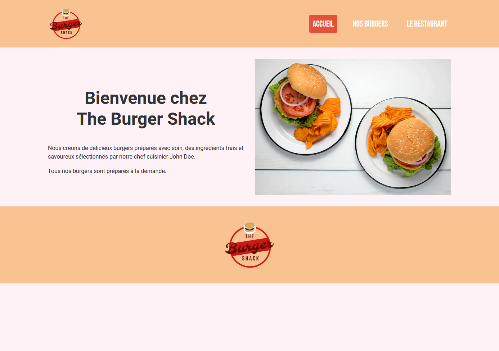

* Page "Nos burgers" (burgers.html) :

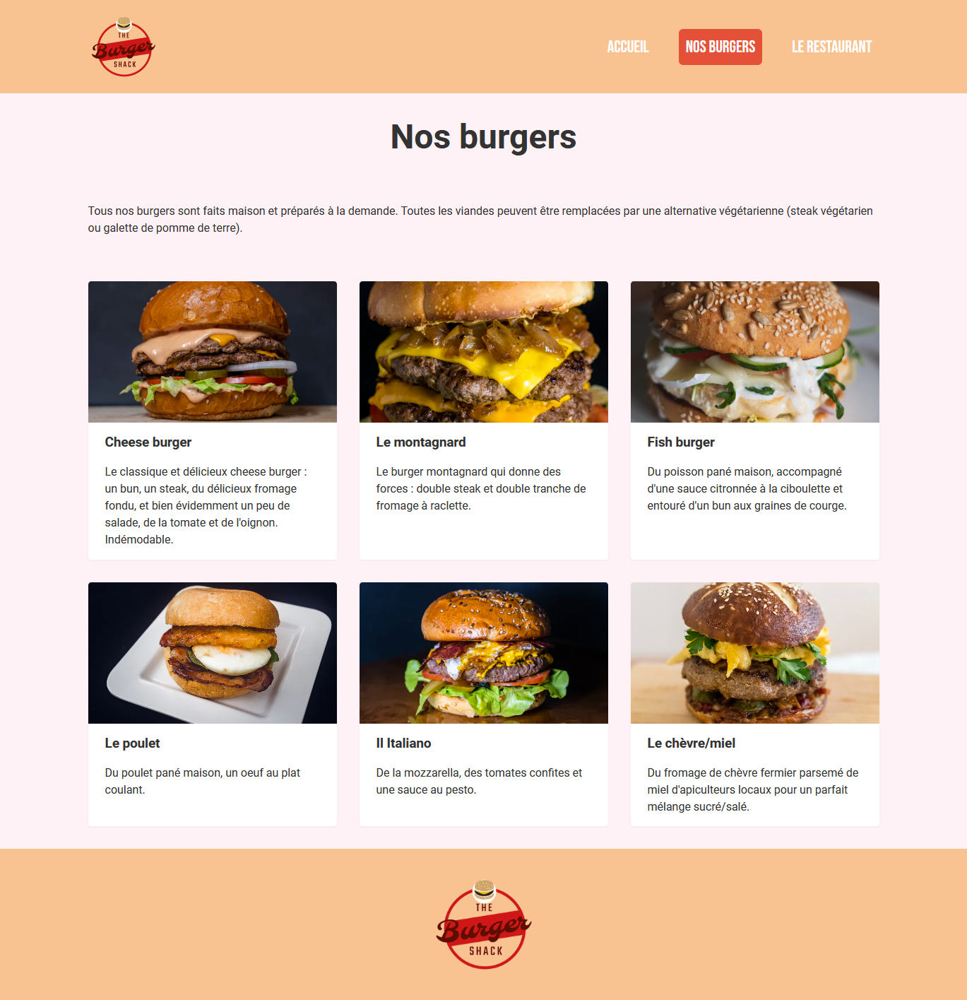

* Page "Le restaurant" (restaurant.html) :

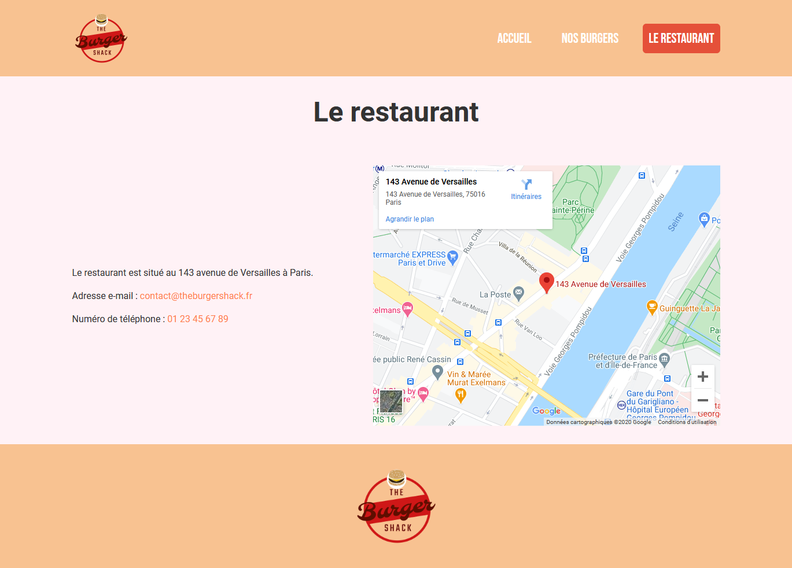

## Etape 1 : initialisation de l'environnement

Pour ce TD, nous allons partir de sources existantes, que nous allons modifier
pour arriver au résultat souhaité.

Téléchargez les sources au format ZIP en [cliquant ici](./src.zip). Puis dézippez
l'archive dans le dossier de votre choix. Vous devriez avoir l'arborescence
suivante :

```console
.
├── burgers.html
├── img
│   ├── cheese-burger.webp
│   ├── chevre-miel.webp
│   ├── fish.webp
│   ├── index-illustration.webp
│   ├── italiano.webp
│   ├── logo.png
│   ├── montagnard.webp
│   └── poulet.webp
├── index.html
├── restaurant.html
└── style.css

1 directory, 12 files
```

Nous avons donc 3 pages :

* index.html : page d'accueil
* burgers.html : page présentant les burgers proposés par le restaurant
* restaurant.html : page présentant les infos de contacts et une carte interactive pour situer le restaurant

Vous pouvez ouvrir les fichiers HTML dans un navigateur et cliquer sur les
liens du menu pour voir les pages.

## Etape 2 : disposition du header et du menu de navigation avec flexbox

Par défaut, le header et le menu ne sont pas positionnés correctement.

|Actuel|Souhaité|
|------|--------|
|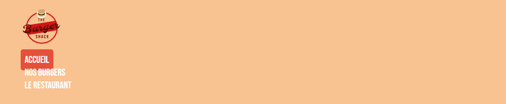|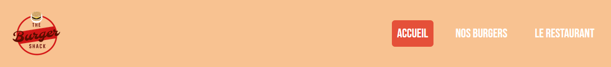|

Premièrement, faites en sorte de positionner le logo et le menu l'un à côté de
l'autre, en utilisant `display: flex`, `align-items` et `justify-content` dans
une règle CSS ciblant l'élément parent du logo et du menu.

Vous devriez arriver au résultat suivant :

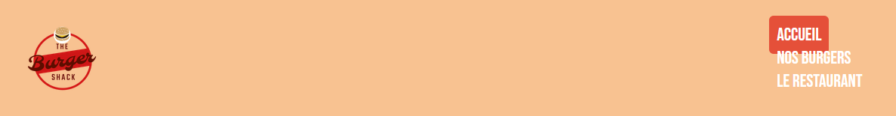

Ensuite, faites en sorte de positionner les éléments du menu les uns à côté des
autres, toujours en utilisant flexbox. Vous devez arriver au résultat suivant :

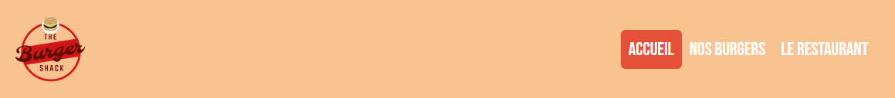

Pour finir, écrivez une règle CSS qui cible les éléments ayant la classe
"nav-list-item" qui sont frères d'un élément ayant la même classe, afin de leur
ajouter une marge à gauche de `32px` afin de les espacer en largeur :

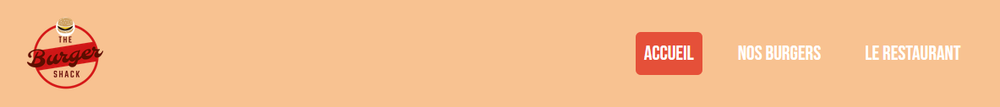

Le header et la navigation sont maintenant bien positionnés et alignés. Bravo
:)

## Etape 3 : le composant "illustrated section"

Le composant "illustrated section" (classe `illustrated-section`) a pour but
d'afficher une section avec du contenu textuel et une image, chacun des deux
éléments prenant 50% de la largeur disponible et étant séparés par une marge de
32px. Les deux éléments sont aussi centrés verticalement.

Voici le résultat que nous souhaitons obtenir :

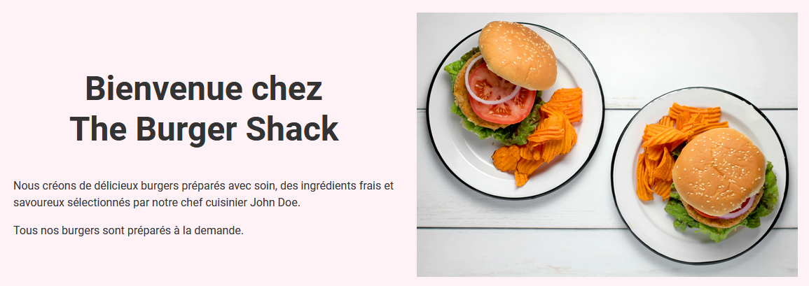

Pour arriver à ce résultat, utilisez `display: grid`, `grid-template-columns`
et `align-items` dans une règle CSS ciblant les éléments ayant la classe
`illustrated-section`.

Ce composant est utilisé sur la page `index.html` et sur la page
`restaurant.html`.

## Etape 4 : footer

Dans le footer, il n'y a qu'un logo. Tout ce que nous souhaitons faire, c'est
le centrer en hauteur et en largeur. A vous de déterminer la technique à
utiliser pour arriver au résultat souhaité :


## Etape 5 : liste des burgers

La page `burgers.html` présente la liste des burgers proposés par le
restaurant. Nous souhaitons afficher cette liste sous forme de grille.

|Actuel|Souhaité|
|------|--------|
|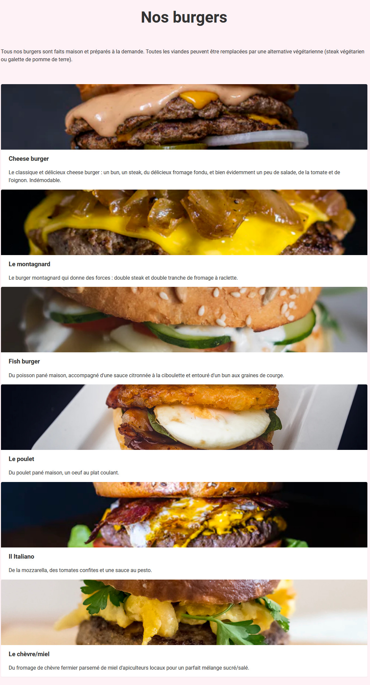|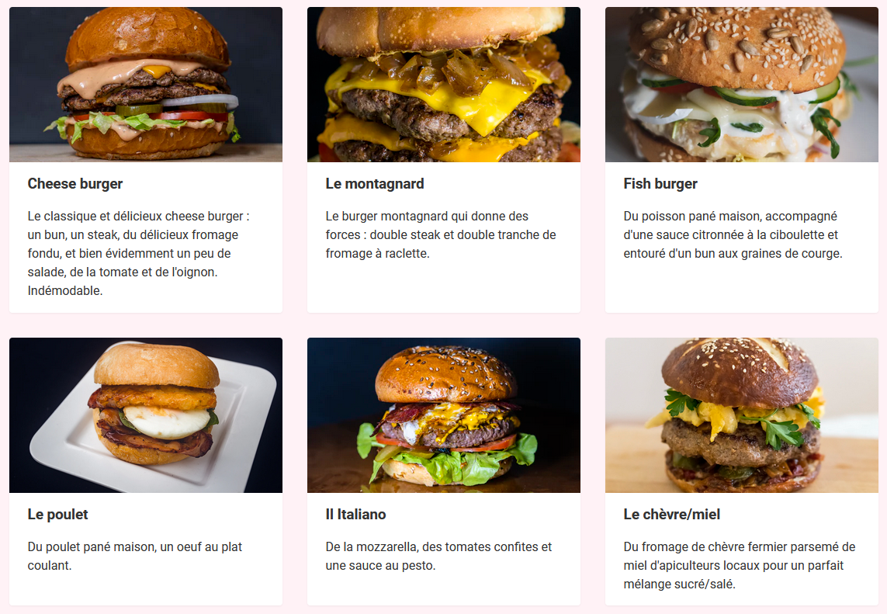|

Utilisez `display: grid` et les propriétés qui y sont liées pour créer une
grille de 3 colonnes mesurant chacune 1/3 de l'espace disponible et séparés
d'une marge de `32px`.

## Conclusion

Grâce aux modules Flexbox et Grid, il est possible de positionner et aligner
des éléments entre eux à peu près de n'importe quelle façon. Il est même
possible de faire des layouts qui s'adaptent à différentes tailles d'écrans
automatiquement (responsive). Vous pouvez aller voir la vidéo suivante pour
voir des exemples : [10 modern layouts in 1 line of
CSS](https://www.youtube.com/watch?v=qm0IfG1GyZU).

Toutefois, il est quand même parfois nécessaire de modifier plus en profondeur
l'affichage à certaines tailles d'écrans. Pour pouvoir faire ça, on verra dans
le prochain cours les media queries.
