# TD responsive

Dans ce TD, l'objectif est d'utiliser les différentes techniques vues en cours
(unités relatives, media queries...) pour adapter le design du site web de The
Burger Shack aux différentes tailles d'écrans, avec une approche "mobile
first".

## Etape 1 : initialisation du projet

Le TD se base sur le site du restaurant The Burger Shack que nous avons
développé la semaine dernière.

Vous pouvez récupérer les sources en [cliquant ici](./src.zip) puis sur le bouton
"download". Comme d'habitude, dézippez les sources dans le dossier de votre
choix, puis affichez les pages dans un navigateur afin de vous assurer que tout
fonctionne correctement.

## Etape 2 : ajout de la meta viewport

Comme nous l'avons vu ensemble, par défaut le comportement des navigateurs
mobiles est d'afficher la page dans une fausse zone de 960px de large, puis d'y
appliquer un facteur de zoom afin qu'elle rentre entièrement dans l'écran de
l'appareil.

En se mettant sur la taille d'écran d'un iPhone SE, par défaut on se retrouve
donc avec quelque chose comme ceci :

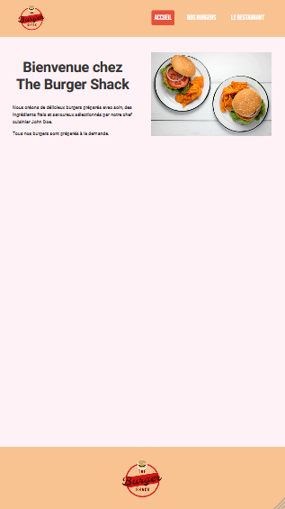

La première chose à faire est donc d'ajouter la balise `<meta />` vue dans les
slides du cours dans la balise `<head>` de nos pages afin de préciser au
navigateur qu'il ne doit pas adopter ce comportement. Une fois ceci fait, vous
obtiendrez un résultat ressemblant à ceci :

On voit donc que le design actuel n'est pas adapté.

Nous allons adopter une stratégie "mobile first" pour régler ce problème. Nous
allons donc commencer par modifier le code actuel afin de faire en sorte que le
site s'affiche bien sur un petit écran (smartphone). Puis nous augmenterons la
taille de l'écran au fur et à mesure et adapterons le style avec des media
queries afin de modifier l'affichage lorsque cela fera sens.

## Etape 3 : styles mobile

Nous souhaitons arriver au résultat suivant :

|index.html|burgers.html|restaurant.html|
|----------|------------|---------------|
|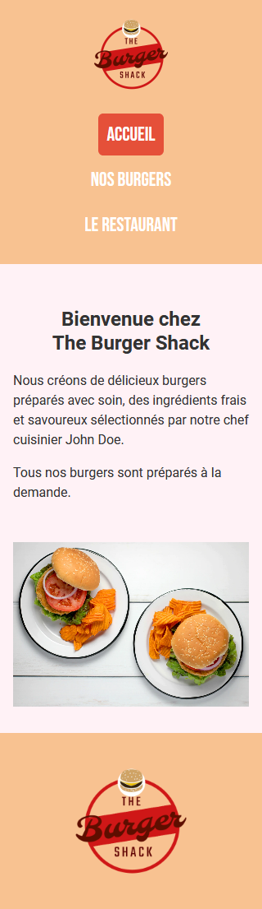|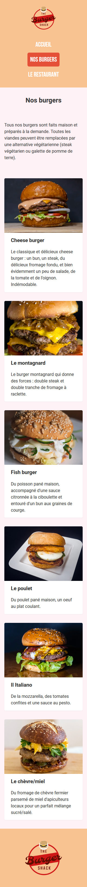|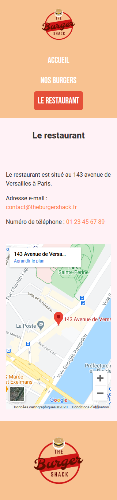|

En résumé, les modifications à faire sont :

* Passer le `.wrapper` se situant à l'intérieur du `.header` en direction `column`
* Passer le `.nav-list` en direction `column`
* Aligner les deux éléments précédents au centre sur l'axe transversal (`align-items`)
* Espacer les `.nav-list-item` frère en hauteur plutôt qu'en largeur
* Faire en sorte que les éléments `.illustrated-section` et `.burgers-list` s'affichent en lignes plutôt qu'en colonnes
* Baisser la `font-size` des `.page-title` (par exemple à `24px`)

## Etape 4 : styles tablette

Lorsqu'on aggrandit la taille de la fenêtre pour arriver autour de `768px`
(taille moyenne de l'écran d'une tablette), on arrive au résultat suivant :

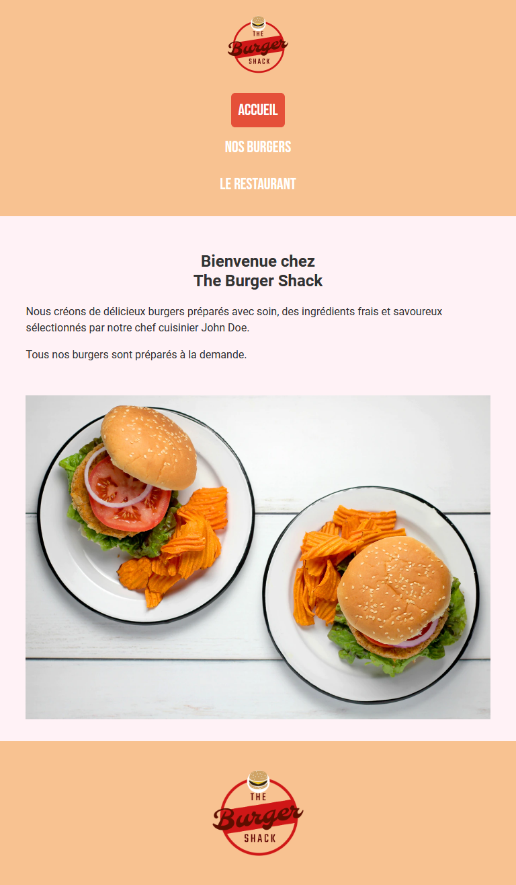

L'affichage n'est pas mauvais en soit. Grâce à l'approche mobile-first, au lieu
de nous retrouver dans un cas où du contenu trop large semble "compressé" en
largeur, on est plutôt dans un cas où le contenu s'affiche bien, mais on
pourrait apporter quelques optimisations.

Par exemple, le menu a maintenant assez de place pour s'affiche en ligne plutôt
qu'en colonne, le titre de la page pourrait avoir une taille de police plus
grande, et la liste des burgers pourrait s'afficher sur deux colonnes.

Ecrivez donc une media query ciblant les écrans faisant au minimum `768px` de
large, dans laquelle vous apportez les modifications suivantes :

* Le `.wrapper` se situant à l'intérieur du `.header` s'affiche en direction `row`
* Le `.nav-list` s'affiche en direction `row`
* Le logo et le `.nav-list` sont séparés de manière à avoir le logo à gauche et le menu à droite
* Les `.nav-list-item` sont espacés les uns des autres en largeur
* Les `.page-title` ont une taille de police de `36px`
* Le `.burgers-list` s'affiche sur 2 colonnes

Vous arriverez au résultat suivant :

|index.html|burgers.html|restaurant.html|
|----------|------------|---------------|
|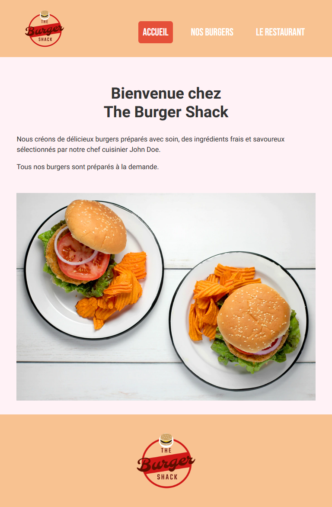|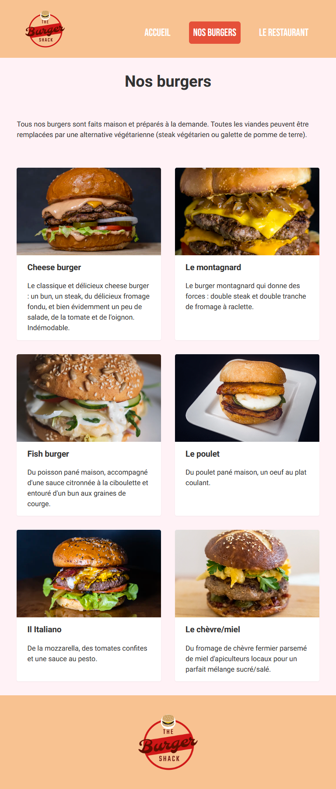|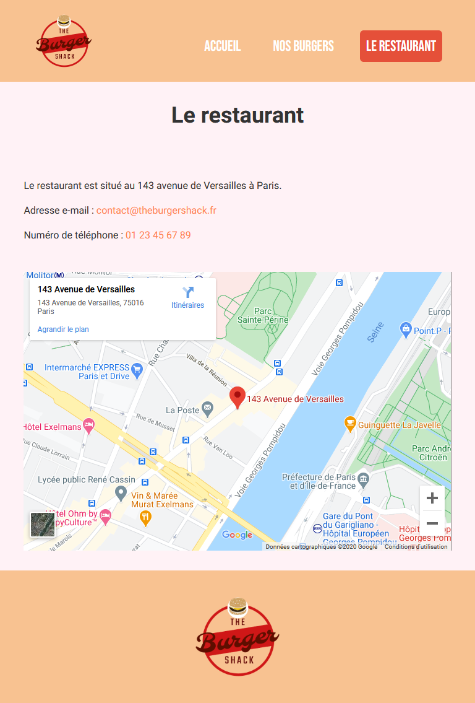|

## Etape 5 : styles desktop

Lorsqu'on aggrandit la taille de la fenêtre jusqu'à `1280px` (taille d'un petit
écran d'ordinateur), on arrive au résultat suivant :

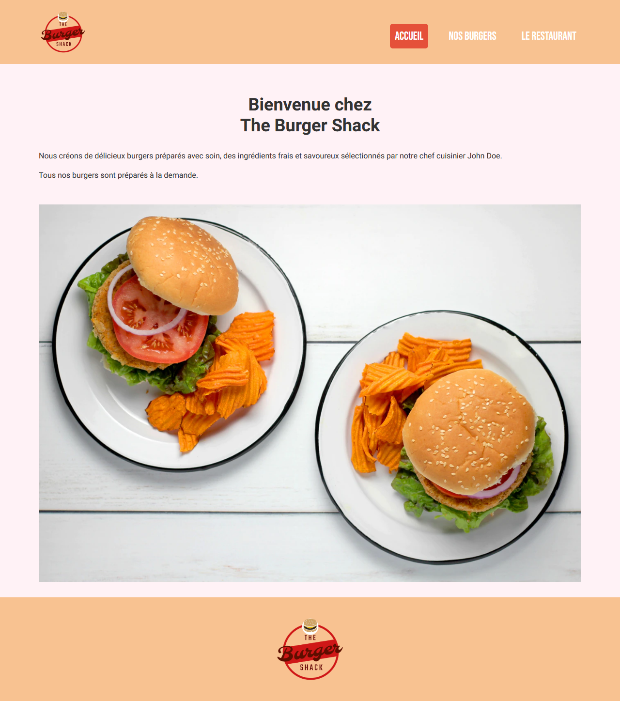

A nouveau, grâce à l'approche mobile-first, le résultat n'est pas mauvais, mais
quelques optimisation peuvent être apportées pour profiter au mieu de l'espace
disponible :

* Les éléments `.illustrated-section` pourraient s'afficher sur deux colonnes
* La liste des burgers pourrait s'afficher sur 3 colonnes
* Les éléments `.page-title` pourraient avoir une plus grande `font-size` (disons `48px`)

Ecrivez une media query qui cible les écrans d'au moins `1280px` de large afin
d'appliquer ces changements. Vous arriverez au résultat suivant :

|index.html|burgers.html|restaurant.html|
|----------|------------|---------------|
|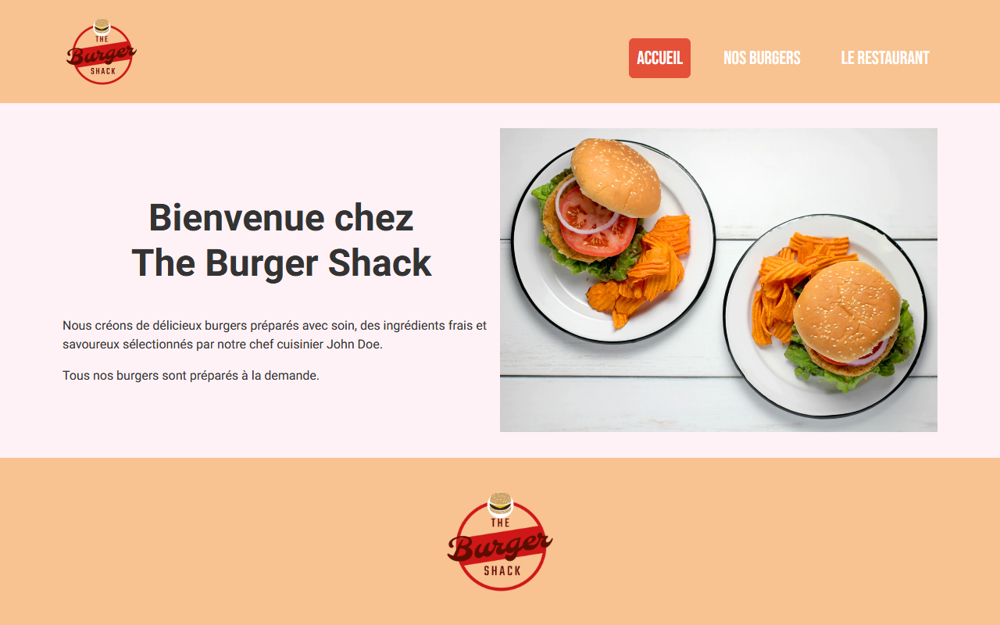|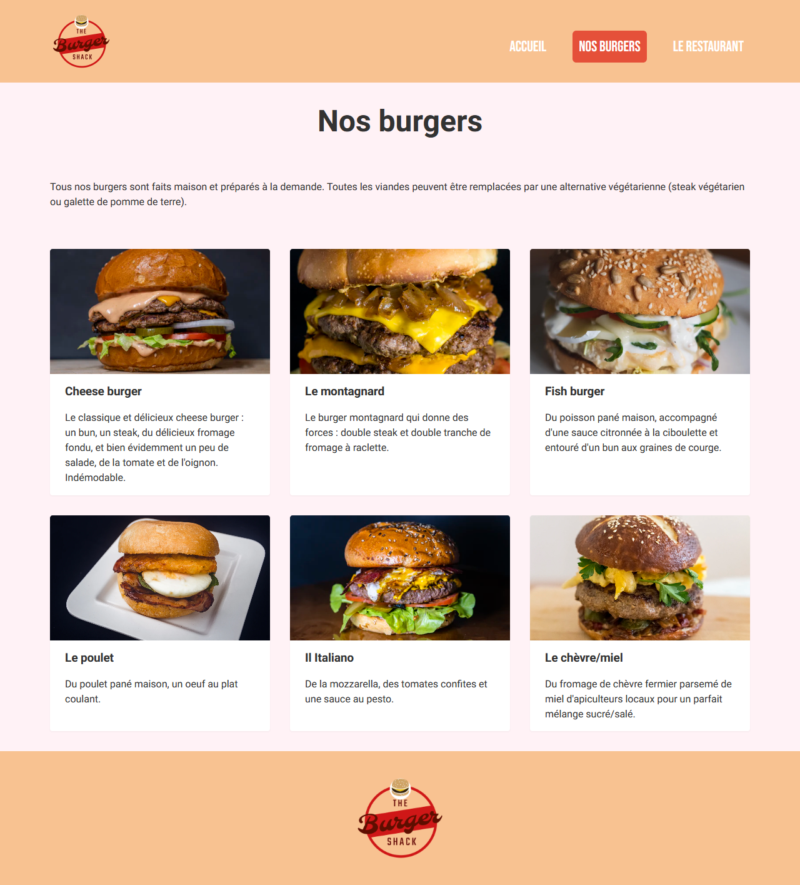|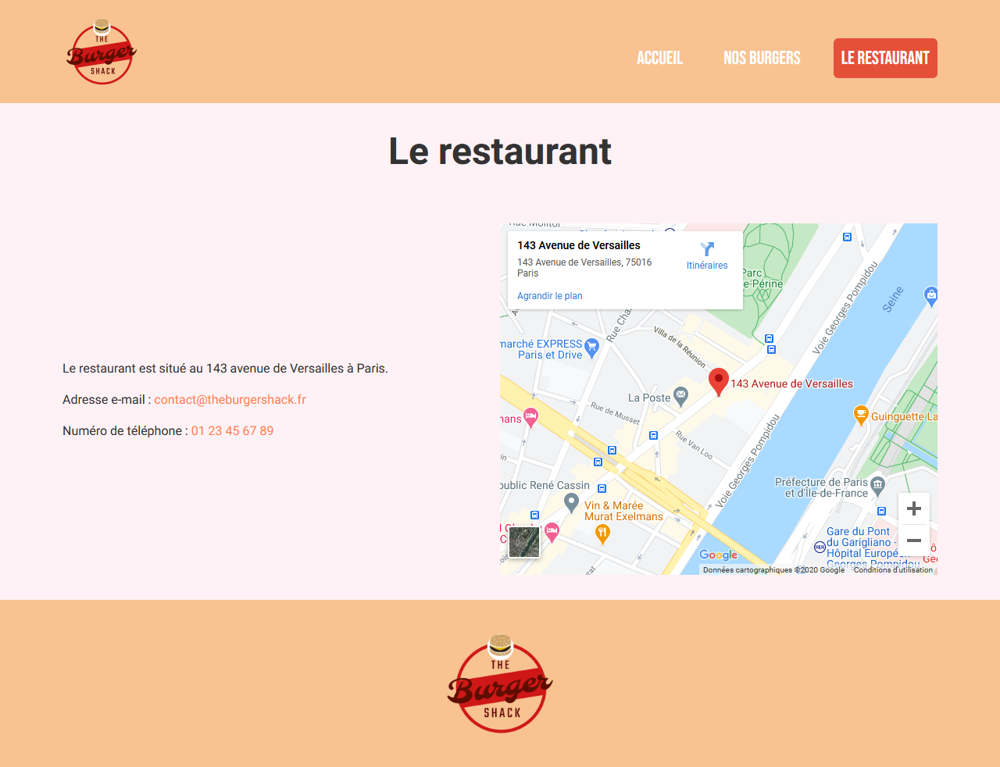|

## Conclusion

Nous sommes maintenant capables d'adapter la mise en page en fonction de
l'espace disponible sur l'écran de l'appareil avec lequel un(e)
utilisateur(trice) consulte nos pages.

L'approche "classique" est de démarrer par les styles sur les écrans larges
("desktop"), puis de rapetisser la fenêtre et faire des adaptations lorsque le
contenu devient trop serré.

L'approche "mobile-first" fait l'inverse : on part de l'affichage sur un petit
écran de smartphone, puis on élargit la fenêtre et on fait des adaptations
lorsque l'espace disponible le permet. Avec cette approche, plutôt que de faire
des adaptations parce que le contenu est devenu illisible du fait du manque
d'espace, on aura toujours du contenu qui s'affiche correctement, mais des
optimisations pourront être apportées au fur et à mesure que de l'espace
devient disponible sur les plus grands écrans. On peut donc faire de
l'amélioration progressive : on part d'une base convenable, et on y ajoute des
détails pour l'améliorer en tirant profit de l'environnement de l'utilisateur.
